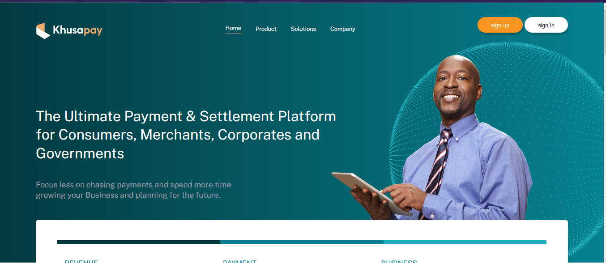

# Khusapay UI (case study)

A user interface for a fictional payment platform created using css and html by [Ryan Mwakio](https://ryanmwakio.netlify.app "Ryan website")



The project is hosted on [case-study-v8.netlify.app](https://case-study-v8.netlify.app/ "Khusa pay website") for the vanilla css and [case-study-v8-tailwind.netlify.app](https://case-study-v8-tailwind.netlify.app/ "Khusa pay website") for the Tailwind based UI

To run the project just clone it into your file system and run the index.html file either through a server or just double click on it, it will open on the browser:

```bash
git clone https://github.com/ryanmwakio/case-study.git
```

---

Folder structure:

The choice of the folder structure is for ease of just getting around the project and understanding where to locate project files and assets.

```
project
│   README.md
│   index.html
|   .gitignore
│
└───folder1
│   │
│   │
│   └───css (all styles from sass files are compiled into styles.css)
│       │   styles.scss
│       │   styles.css
│       │   ...
│
└───folder2
    │
    │
    |____images (all project images)
```
